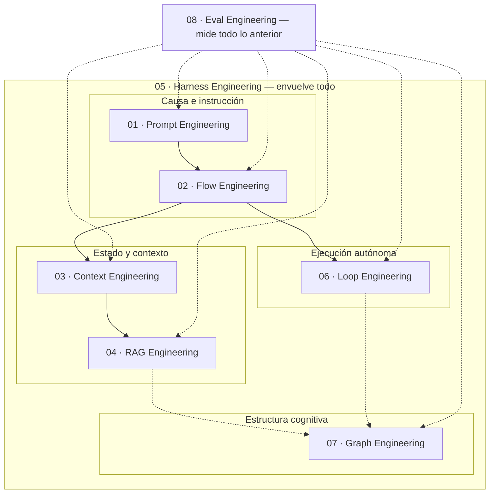

# 00 · Panorama Sistémico

[← Índice](../README.md)

---

## De la instrucción al sistema

El desarrollo de aplicaciones sobre LLM pasó de ser un ejercicio centrado en el modelo a ser una disciplina de ingeniería de software distribuido. La causa es estructural, no de moda: los modelos probabilísticos no tienen determinismo estricto, su atención está acotada por una ventana de contexto finita, y no pueden actuar sobre el mundo real de forma aislada. Cada una de las ocho ingenierías de este repositorio existe porque resuelve una de esas tres limitaciones — o gobierna a las que sí lo hacen.

## Relación de inclusión escalar

No son ocho disciplinas paralelas del mismo tamaño. Hay una relación de inclusión, de la unidad más pequeña a la envolvente más grande:

- **Prompt Engineering** gobierna una invocación individual al modelo.
- **Context Engineering** administra el flujo de información en la memoria de trabajo durante esa invocación o varias.
- **Flow Engineering** organiza secuencias de razonamiento en fases lógicas verificables.
- **Harness Engineering** envuelve a todas las anteriores dentro de infraestructura con sandboxes, herramientas, observabilidad y barreras de seguridad.
- **RAG Engineering** y **Graph Engineering** proveen los cimientos de fundamentación fáctica y estructuración de estados complejos.
- **Loop Engineering** sostiene la continuidad temporal de la ejecución autónoma.
- **Eval Engineering** es el mecanismo de medición que valida científicamente cada una de las anteriores — no está "al lado", está *debajo* de todas, como instrumentación.

## Por qué importa separar las disciplinas

Tratar "todo esto" como una sola cosa indiferenciada — "prompting", en la acepción más laxa del término — produce el patrón de falla más común en sistemas agénticos de 2026: alguien intenta resolver un problema de estado persistente (Context Engineering) escribiendo un prompt más largo (Prompt Engineering), o intenta resolver falta de determinismo en el arnés (Harness Engineering) agregando más ejemplos few-shot (Prompt Engineering, de nuevo). Cada disciplina tiene su propio estándar, su propio conjunto de indicadores y su propio catálogo de anti-patrones — mezclarlas no ahorra trabajo, lo esconde hasta que aparece en producción.

## Hacia dónde va la disciplina

A medida que los modelos desarrollen capacidades de razonamiento nativo más elevadas, es esperable que parte del andamiaje de software más rígido se pueda simplificar. Pero la necesidad de garantizar determinismo, seguridad de ejecución, gobernanza presupuestaria y auditabilidad en entornos de producción asegura que la distinción entre el modelo probabilístico y la infraestructura de ingeniería que lo rodea va a seguir siendo el factor determinante del éxito — no una fase transitoria a superar.

## Cómo navegar este repositorio

1. **Si estás empezando un sistema desde cero**: leé las ocho páginas en orden — cada una asume la anterior.
2. **Si ya tenés un sistema en producción y buscás dónde falla**: andá directo a la [Matriz de Madurez](../maturity-model/MATURITY-MATRIX.md), ubicá en qué nivel estás por disciplina, y entrá a la página de la disciplina con el nivel más bajo.
3. **Si buscás herramientas concretas**: cada página de disciplina tiene su propia sección de Recursos Curados — no hay una lista única de herramientas separada del contexto de para qué sirven.
4. **Si buscás vocabulario compartido**: [`resources/glossary.md`](../resources/glossary.md).

## Índice de disciplinas

| # | Disciplina | Resuelve |
|---|---|---|
| 01 | [Prompt Engineering](01-prompt-engineering.md) | Una invocación aislada al modelo |
| 02 | [Flow Engineering](02-flow-engineering.md) | Tareas de múltiples fases verificables |
| 03 | [Context Engineering](03-context-engineering.md) | Estado dentro de la ventana de contexto activa |
| 04 | [RAG Engineering](04-rag-engineering.md) | Conocimiento externo no paramétrico |
| 05 | [Harness Engineering](05-harness-engineering.md) | Infraestructura completa de ejecución autónoma |
| 06 | [Loop Engineering](06-loop-engineering.md) | Bucles de ejecución con criterio de parada |
| 07 | [Graph Engineering](07-graph-engineering.md) | Estructura cognitiva y de conocimiento como grafo |
| 08 | [Eval Engineering](08-eval-engineering.md) | Medición cuantitativa de todo lo anterior |
